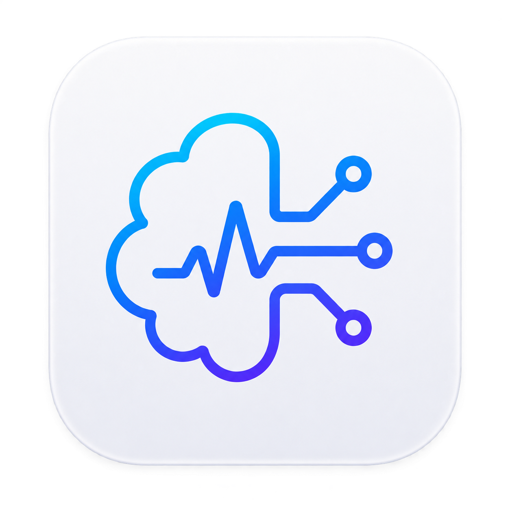

<p align="center">
  
</p>

<h1 align="center">UOSLabManager</h1>

<p align="center">
  여러 실험 장비의 제어, 실시간 측정, 자동 시퀀스, 카메라 분석을 하나의 작업 공간으로 통합한 플러그인 기반 데스크톱 애플리케이션
</p>

UOSLabManager는 실험 장비마다 흩어진 제어 프로그램과 기록 방식을 하나의 PyQt6 GUI로 통합합니다. 장비 드라이버, 제어 패널, 실험 워크플로를 플러그인으로 분리했기 때문에 새로운 장비를 추가해도 핵심 애플리케이션과 시퀀스 화면을 직접 수정할 필요가 없습니다.

## 주요 특징

- **플러그인 기반 장비 통합** — `plugin.json`과 Python 모듈로 장비 및 실험 기능을 검색하고 다시 불러옵니다.
- **응답성을 유지하는 스레드 구조** — 연결된 장비마다 전용 worker thread가 생성되며, 연결·명령·polling·종료가 같은 스레드에서 수행됩니다. 시퀀스와 카메라 캡처도 GUI thread와 분리됩니다.
- **GUI와 분리된 시퀀스 엔진** — Qt에 의존하지 않는 `SequenceEngine`이 recipe 검증과 실행을 담당합니다. 장비 플러그인이 명령의 단위, 범위, 선택지와 실행 함수를 선언합니다.
- **측정 데이터 출처 추적** — atomic snapshot에 sample ID, UTC 취득 시각, 응답 시간, 데이터 age와 freshness를 함께 기록합니다. 같은 cached sample의 중복 저장을 줄이면서 stale·연결 상태 변화는 보존합니다.
- **실시간 데이터 작업 공간** — 선택 가능한 그래프, 표, 로그, CSV 기록과 sequence marker를 한곳에서 관리합니다.
- **복합 장비 지원** — CTvideo처럼 pyrometer, USB camera, calibration, display control을 함께 다루는 장비는 `composite` profile과 전용 패널을 사용할 수 있습니다.
- **Plugin Studio와 Codex 연동** — 플러그인 생성·편집·검증·가져오기·내보내기·reload를 지원하며, Codex가 만든 변경은 staging 영역에서 검토한 뒤 적용하거나 폐기할 수 있습니다.
- **안전 동작** — 상단의 `STOP`으로 실험을 중지하고 연결된 출력 장비의 안전 종료를 시도합니다. 위험한 calibration·출력 변경에는 확인 절차가 포함됩니다.
- **지연형 로딩 표시** — 짧은 작업에는 불필요한 화면 전환을 만들지 않고, 작업이 길어질 때만 글자 없는 로딩 애니메이션을 표시합니다.

## 기본 제공 플러그인

### 장비

| 장비 ID | 표시 이름 | Profile | 주요 기능 |
| --- | --- | --- | --- |
| `K2400` | Keithley 2400 | Standard | GPIB/VISA 연결, source 설정, 측정, sequence 명령 |
| `GPD3303S` | GPD-3303S | Standard | Serial 전원공급기 제어와 채널 측정 |
| `ZUP` | ZUP36-12 | Standard | 전압·전류 설정, 출력 제어, 상태 측정, sequence 명령 |
| `LS331` | Lake Shore 331 | Standard | 온도·heater 측정, setpoint와 heater 제어, calibration curve 관리 |
| `CTVIDEO3M` | CTvideo 3M | Composite | Pyrometer, USB video, display 설정, calibration, 플랫폼별 장치 탐색 |

`plugins/devices/zup36_6`은 Plugin Studio에서 생성한 standard-device 확장 예시도 함께 제공합니다. 실제 장비에 사용하기 전에는 driver와 안전 범위를 장비 사양에 맞게 구현하고 검증해야 합니다.

### 실험

| 플러그인 ID | 기능 |
| --- | --- |
| `heating_control` | ZUP36-12와 CTvideo 3M을 결합한 가열 제어 workspace |
| `line_profile` | 카메라 영상의 live line profile, animation, kymograph 분석 |
| `thermo` | 사용자 실험 패널 scaffold |

장비명은 호환 대상을 식별하기 위한 용도이며, 본 프로젝트는 해당 제조사와 제휴하거나 제조사의 보증을 받지 않습니다.

## 설치 및 실행

### 요구 사항

- Python과 `pip`
- 장비 연결에 필요한 OS driver
- VISA 장비 사용 시 NI-VISA 등 호환 VISA backend
- 실제 장비 연결 전 각 장비의 통신 설정과 안전 한계 확인

Windows PowerShell 기준:

```powershell
git clone https://github.com/DaintyCandy/UOSLabManager.git
cd UOSLabManager
python -m venv .venv
.\.venv\Scripts\Activate.ps1
python -m pip install --upgrade pip
python -m pip install -r requirements.txt
python main.py
```

실행하면 repository 또는 실행 파일 위치에 `data/`와 `camera_recordings/`가 생성됩니다. 배포 빌드의 편집 가능한 플러그인은 `%LOCALAPPDATA%\UOSLabManager\plugins`에 준비됩니다. 개발 중 다른 플러그인 경로를 사용하려면 `UOSLAB_PLUGIN_DIR` 환경 변수를 설정할 수 있습니다.

## 기본 사용 흐름

1. 왼쪽 dashboard에서 사용할 장비 또는 실험 플러그인을 엽니다.
2. 장비 설정 패널에서 port 또는 VISA address를 확인한 뒤 연결합니다.
3. **Data** 탭에서 표시할 column을 선택하고 실시간 값과 freshness 상태를 확인합니다.
4. 필요한 경우 recording을 시작하거나 **Sequence** 탭에서 recipe를 작성·불러옵니다.
5. 시퀀스를 실행하고 log marker와 함께 결과를 CSV로 저장합니다.
6. 이상 동작 시 상단의 **STOP**을 사용하고, 종료 전 장비 연결 상태를 확인합니다.

장비 통신은 실제 하드웨어 출력에 영향을 줄 수 있습니다. 처음 사용하는 플러그인은 출력이 없는 상태에서 연결·읽기·중지 동작을 먼저 검증하세요.

## 동작 구조

```text
PyQt6 GUI
├─ Dashboard / Device panels / Experiment panels
├─ Data / Sequence / Camera / Plugin Studio
│
├─ DeviceManager ── DeviceWorker-<device_id> (장비별 전용 thread)
├─ MeasurementPipeline ── atomic snapshot / freshness / CSV
├─ SequenceEngine ── GUI 독립 recipe 검증·실행
└─ PluginManager
   ├─ plugins/devices/<id>       장비 플러그인
   └─ plugins/experiments/<id>   실험 플러그인
```

### 장비 스레드

장비를 연결하면 `DeviceManager`가 장비별 `DeviceWorker-<device_id>`를 생성합니다. driver 생성, 주기 측정, panel과 sequence에서 요청한 명령, disconnect가 이 worker에서 직렬화되므로 GUI thread에서 장비 I/O를 직접 수행하지 않습니다. UI widget 자체는 Qt 규칙에 따라 GUI thread에 남습니다.

### 시퀀스

`core.sequence_engine.SequenceEngine`은 Qt를 import하지 않습니다. `SequenceCommand` metadata를 이용해 값을 검증하고 플러그인이 제공한 executor를 호출하며, wait는 취소 가능한 방식으로 처리합니다. 기본 system command는 다음과 같습니다.

- `Wait Time`, `Wait Until`
- `Log Marker`
- `Start Recording`, `Stop Recording`
- `Safe Output Off`

Recipe는 `schema_version: 1` JSON 형식을 사용합니다. 장비 명령을 추가할 때는 해당 플러그인의 `sequence_commands`에 선언하면 되며, `gui/panel_sequence.py`에 장비별 분기를 추가하지 않습니다.

### 측정 데이터

`DeviceManager.read_snapshot()`은 연결된 장비들의 값을 한 시점의 snapshot으로 반환합니다. 각 sample에는 다음 provenance 정보가 포함됩니다.

- 증가하는 `sample_id`
- `sampled_at_utc`
- `response_ms`
- snapshot 시점의 `age_ms`
- freshness 상태

`MeasurementPipeline`은 sample, 연결 상태, freshness 상태가 바뀌거나 sequence marker가 들어온 경우에 기록 행을 만듭니다. 이 방식은 polling 주기만큼 같은 값을 복제하는 문제를 줄이면서 데이터가 stale로 전환된 시점은 남깁니다.

## Plugin Studio

Plugin Studio에서는 장비와 실험 플러그인을 애플리케이션 안에서 관리할 수 있습니다.

- 새 standard/composite device 또는 experiment 생성
- Python/JSON 파일 편집과 syntax highlighting
- ZIP 가져오기·내보내기 및 manifest 검증
- 변경 후 플러그인 reload
- 트리 우클릭으로 plugin ID 편집
- composite device 트리 우클릭으로 임의의 내부 `.py` 파일 추가
- Codex 제안의 diff·검증 결과 확인 후 **Apply** 또는 **Reject**

### 장비 profile 선택

**Standard device**는 단일 통신 장비에 적합합니다. 새로 만들 때 공유 연결 패널 스타일을 따르는 `panel.py`가 기본 생성되며, driver I/O는 장비 worker를 통해 호출합니다.

**Composite device**는 CTvideo처럼 여러 resource나 전용 UI가 필요한 장비에 적합합니다. manifest의 owned resource와 permission을 명시하고, 기능별 Python 모듈을 패키지 내부에 나눌 수 있습니다.

새 플러그인의 UI를 Codex로 작성할 때는 기존 장비 패널의 layout, widget 간격, 상태 표시, 비동기 연결, 지연형 로딩 방식을 참고하도록 Plugin Studio의 작업 지침이 구성되어 있습니다. Codex 결과는 곧바로 원본에 쓰이지 않고 staging 영역에서 먼저 검토합니다.

### 플러그인 ID 규칙

- 길이 1–64자의 ASCII 영문자, 숫자, underscore만 사용
- 첫 글자는 영문자
- Python keyword 사용 금지
- Windows 예약 파일명(`CON`, `PRN`, `COM1`, `LPT1` 등) 사용 금지
- 대소문자만 다른 중복 ID 사용 금지

파일 경로는 선택한 플러그인 패키지 안에 있어야 하며, Python 파일과 하위 package 이름은 유효한 Python identifier여야 합니다.

## 프로젝트 구조

```text
UOSLabManager/
├─ main.py                       애플리케이션 진입점
├─ core/
│  ├─ device_manager.py          장비 worker와 thread-safe proxy
│  ├─ measurement_pipeline.py    측정 snapshot과 기록 정책
│  ├─ sequence_engine.py         GUI 독립 sequence engine
│  └─ plugin_manager.py          manifest 검색·검증·가져오기·내보내기
├─ gui/
│  ├─ main_window.py             주 작업 공간
│  ├─ panel_*.py                 Data, Sequence, Camera, Settings
│  └─ plugin_studio/             편집기와 Codex staging UI
├─ plugins/
│  ├─ devices/                   standard/composite 장비 플러그인
│  └─ experiments/               실험 패널 및 workflow
├─ assets/                       앱 아이콘 등 정적 자산
├─ tests/                        core, 장비, UI 회귀 테스트
└─ UOSLabManager.spec            Windows PyInstaller 설정
```

## 테스트

전체 테스트:

```powershell
python -m unittest discover -s tests -v
```

GUI 테스트는 PyQt6와 Qt runtime이 서로 호환되는 환경에서 실행해야 합니다. 실제 전원공급기나 heater를 사용하는 검증은 mock/unit test와 분리하고, 장비 매뉴얼의 안전 절차를 따르세요.

## Windows 실행 파일 빌드

```powershell
python -m PyInstaller --noconfirm UOSLabManager.spec
```

빌드 결과는 `dist/UOSLabManager/`에 생성됩니다. 실행 창과 Windows 실행 파일에는 `assets/uoslabmanager_icon.png` 및 `assets/uoslabmanager_icon.ico`가 적용됩니다.

생성된 실행 파일만 별도로 배포하지 마세요. GPL 조건에 따라 해당 binary와 정확히 대응하는 전체 source, build specification, dependency 정보를 함께 제공해야 합니다. 빌드에는 `LICENSE`, `THIRD_PARTY_NOTICES.md`와 설치된 Python distribution에서 찾은 license 파일이 포함됩니다.

## 라이선스

Copyright (C) 2026 UOSLabManager contributors.

UOSLabManager의 자체 source code는 [GNU General Public License v3.0 or later](LICENSE), SPDX `GPL-3.0-or-later`로 배포됩니다. This program is distributed without any warranty. 상품성이나 특정 목적 적합성을 포함한 어떠한 보증도 제공하지 않습니다.

제3자 library, 장비 firmware, 제조사 software, manual, logo와 trademark는 각 권리자의 조건을 따릅니다. 자세한 내용은 [THIRD_PARTY_NOTICES.md](THIRD_PARTY_NOTICES.md)를 확인하세요.
