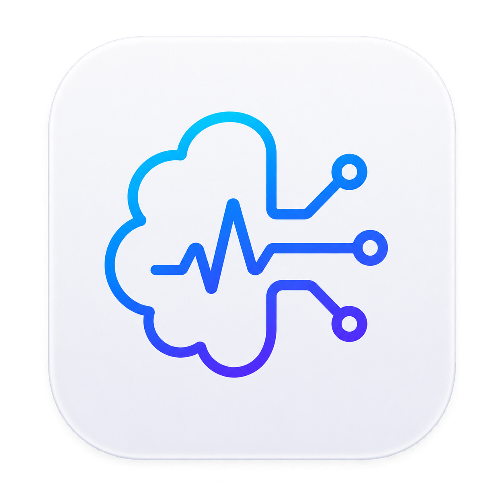

<p align="center">
  
</p>

<h1 align="center">UOSLabManager</h1>

<p align="center">
  여러 실험 장비의 제어, 실시간 측정, 자동 시퀀스, 카메라 분석을 하나의 작업 공간으로 통합한 플러그인 기반 데스크톱 애플리케이션
</p>

UOSLabManager는 실험 장비마다 흩어진 제어 프로그램과 기록 방식을 하나의 PyQt6 GUI로 통합합니다. 장비 드라이버, 제어 패널, 실험 워크플로를 플러그인으로 분리했기 때문에 새로운 장비를 추가해도 핵심 애플리케이션과 시퀀스 화면을 직접 수정할 필요가 없습니다.

## 주요 특징

- **플러그인 기반 장비 통합** — `plugin.json`과 Python 모듈로 장비 및 실험 기능을 검색하고 다시 불러옵니다.
- **응답성을 유지하는 스레드 구조** — 연결된 장비마다 전용 worker thread가 생성되며, 연결·명령·polling·종료가 같은 스레드에서 수행됩니다. 시퀀스와 카메라 캡처도 GUI thread와 분리됩니다.
- **GUI와 분리된 시퀀스 엔진** — Qt에 의존하지 않는 `SequenceEngine`이 recipe 검증과 실행을 담당합니다. 장비 플러그인이 명령의 단위, 범위, 선택지와 실행 함수를 선언합니다.
- **측정 데이터 출처 추적** — atomic snapshot에 sample ID, UTC 취득 시각, 응답 시간, 데이터 age와 freshness를 함께 기록합니다. 같은 cached sample의 중복 저장을 줄이면서 stale·연결 상태 변화는 보존합니다.
- **실시간 데이터 작업 공간** — 선택 가능한 그래프, 표, 로그, CSV 기록과 sequence marker를 한곳에서 관리합니다.
- **Plugin Studio와 Codex 연동** — 플러그인 생성·편집·검증·가져오기·내보내기·reload를 지원하며, Codex가 만든 변경은 staging 영역에서 검토한 뒤 적용하거나 폐기할 수 있습니다.
- **안전 동작** — 상단의 `STOP`으로 실험을 중지하고 연결된 출력 장비의 안전 종료를 시도합니다. 위험한 calibration·출력 변경에는 확인 절차가 포함됩니다.

## 설치 및 실행

### 요구 사항

- Python과 `pip`
- 장비 연결에 필요한 OS driver
- VISA 장비 사용 시 NI-VISA 등 호환 VISA backend
- 실제 장비 연결 전 각 장비의 통신 설정과 안전 한계 확인

Windows PowerShell 기준:

```powershell
git clone https://github.com/DaintyCandy/UOSLabManager.git
cd UOSLabManager
python -m venv .venv
.\.venv\Scripts\Activate.ps1
python -m pip install --upgrade pip
python -m pip install -r requirements.txt
python main.py
```

실행하면 repository 또는 실행 파일 위치에 `data/`와 `camera_recordings/`가 생성됩니다. 배포 빌드의 편집 가능한 플러그인은 `UOSLabManager.exe` 옆의 `plugins` 폴더에 있습니다. 다른 플러그인 경로를 사용하려면 `UOSLAB_PLUGIN_DIR` 환경 변수를 설정할 수 있습니다.

## 기본 사용 흐름

1. 왼쪽 dashboard에서 사용할 장비 또는 실험 플러그인을 엽니다.
2. 장비 설정 패널에서 port 또는 VISA address를 확인한 뒤 연결합니다.
3. **Data** 탭에서 표시할 column을 선택하고 실시간 값과 freshness 상태를 확인합니다.
4. 필요한 경우 recording을 시작하거나 **Sequence** 탭에서 recipe를 작성·불러옵니다.
5. 시퀀스를 실행하고 log marker와 함께 결과를 CSV로 저장합니다.
6. 이상 동작 시 상단의 **STOP**을 사용하고, 종료 전 장비 연결 상태를 확인합니다.

장비 통신은 실제 하드웨어 출력에 영향을 줄 수 있습니다. 처음 사용하는 플러그인은 출력이 없는 상태에서 연결·읽기·중지 동작을 먼저 검증하세요.

## 가로·세로 화면 모드

상단 설정 버튼을 눌러 **Settings → 일반 → 화면 배치**에서 **가로 / 세로**를
선택합니다. 프로그램 정보와 라이선스는 **Settings → 정보 및 라이선스**에 있습니다.
별도 실행 파일이나
플러그인 재로딩 없이 기존 창에서 레이아웃만 바뀝니다.

- 선택 시 가로는 1360×800, 세로는 800×1360 논리 픽셀로 창 크기를 한 번
  조정합니다. 현재 모니터의 작업 영역보다 크면 화면 안에 맞춥니다.
- 이후 창 크기를 자유롭게 조절해도 선택한 배치를 유지합니다. 자동 모드는 없으며,
  기존 자동 설정은 가로로 전환됩니다. 재실행 시에는 마지막 창 크기를 복원합니다.
- 세로형에서는 그래프·카메라 분할과 Sequence 화면을 위아래로 배치하고 장비
  목록을 기본적으로 접습니다. `장비 및 실험` 버튼으로 목록을 다시 엽니다.
- 장비·실험 플러그인은 가로 모드에서는 왼쪽에서 세로로, 세로 모드에서는
  상단에서 가로로 나열됩니다. 상단 목록의 폭이 부족하면 다음 줄로 이어지고,
  플러그인이 많으면 목록 안에서 스크롤합니다.
- 탭은 한 번에 하나씩 표시합니다. 그래프·카메라 탭 내부의 기존 분할은 유지됩니다.
- 모드 선택, 모드별 장비 목록 표시 상태, 그래프·카메라 분할 크기는 저장됩니다.
  상세 설정이 길면 탭의 스크롤로 이동합니다.

### 플러그인 레이아웃 규약

장비 및 실험 플러그인의 QWidget은 선택적으로 다음 메서드를 구현할 수 있습니다.

```python
def set_layout_mode(self, mode):
    # mode is "wide" (landscape) or "compact" (portrait).
    self.splitter.setOrientation(
        Qt.Orientation.Vertical if mode == "compact"
        else Qt.Orientation.Horizontal
    )
```

호스트는 패널 생성 직후와 모드 변경 시 열린 패널에 이 메서드를 호출합니다.
레이아웃만 변경하고 동일한 위젯, 입력값, 스냅샷, 장비 연결, 타이머와 작업
스레드를 유지해야 합니다. `plugin.json`과 기존 factory API는 변경하지 않습니다.
메서드가 없는 외부 플러그인도 기존 QScrollArea 안에서 계속 작동합니다.

내장 플러그인은 `gui.layout_mode`의 `AdaptivePanelMixin`, `AdaptiveRowLayout`,
`AdaptiveGridLayout`, `AdaptiveSplitter`를 사용합니다. Plugin Studio에서 생성·수정하는
플러그인에도 같은 규약과 참고 코드가 제공됩니다.

## Heating Control 실행 중 설정

Heating Control 실행 중에도 목표 온도와 **Current Ramp**를 편집할 수 있습니다.
Current Ramp의 **Rate**는 전류 상승·하강 변화율(A/s, 0.001–12)이며,
해당 그룹의 **Apply**를 눌러야 다음 온도 샘플부터 적용됩니다. 제어를 재시작하거나
출력을 즉시 변경하지 않습니다. Enabled를 해제하고 Apply하면 전류 변화율 제한만
해제됩니다. PID 계수, 안전 온도 및 출력 한계는 실행 중 잠겨 있으며 그대로 유지됩니다.

## Plugin Studio

Plugin Studio에서는 장비와 실험 플러그인을 애플리케이션 안에서 관리할 수 있습니다.

- 새 standard/composite device 또는 experiment 생성
- Python/JSON 파일 편집과 syntax highlighting
- ZIP 가져오기·내보내기 및 manifest 검증
- 변경 후 플러그인 reload
- 트리 우클릭으로 plugin ID 편집
- composite device 트리 우클릭으로 임의의 내부 `.py` 파일 추가
- Codex 제안의 diff·검증 결과 확인 후 **Apply** 또는 **Reject**

### 장비 profile 선택

**Standard device**는 단일 통신 장비에 적합합니다. 새로 만들 때 공유 연결 패널 스타일을 따르는 `panel.py`가 기본 생성되며, driver I/O는 장비 worker를 통해 호출합니다.

**Composite device**는 CTvideo처럼 여러 resource나 전용 UI가 필요한 장비에 적합합니다. manifest의 owned resource와 permission을 명시하고, 기능별 Python 모듈을 패키지 내부에 나눌 수 있습니다.

새 플러그인의 UI를 Codex로 작성할 때는 기존 장비 패널의 layout, widget 간격, 상태 표시, 비동기 연결, 지연형 로딩 방식을 참고하도록 Plugin Studio의 작업 지침이 구성되어 있습니다. Codex 결과는 곧바로 원본에 쓰이지 않고 staging 영역에서 먼저 검토합니다.

### 플러그인 ID 규칙

- 길이 1–64자의 ASCII 영문자, 숫자, underscore만 사용
- 첫 글자는 영문자
- Python keyword 사용 금지
- Windows 예약 파일명(`CON`, `PRN`, `COM1`, `LPT1` 등) 사용 금지
- 대소문자만 다른 중복 ID 사용 금지

파일 경로는 선택한 플러그인 패키지 안에 있어야 하며, Python 파일과 하위 package 이름은 유효한 Python identifier여야 합니다.

## 라이선스

Copyright (C) 2026 UOSLabManager contributors.

UOSLabManager의 자체 source code는 [GNU General Public License v3.0 or later](LICENSE), SPDX `GPL-3.0-or-later`로 배포됩니다. This program is distributed without any warranty. 상품성이나 특정 목적 적합성을 포함한 어떠한 보증도 제공하지 않습니다.

제3자 library, 장비 firmware, 제조사 software, manual, logo와 trademark는 각 권리자의 조건을 따릅니다. 자세한 내용은 [THIRD_PARTY_NOTICES.md](THIRD_PARTY_NOTICES.md)를 확인하세요.
